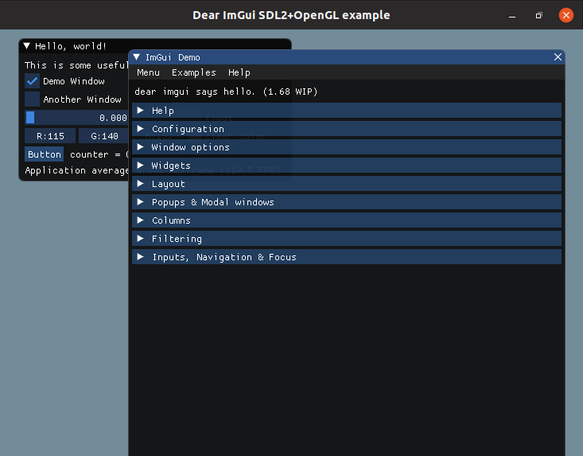

## Introduction

Minimal GUI example project using ImGui, SDL2, OpenGL 2.0 and CMake.



* [imgui](https://github.com/ocornut/imgui) - Minimal GUI.
* [SDL2](https://www.libsdl.org/) - Multimedia layer library.

## Using ImGui in a CMake Project 

To use the ImGui in a CMake project one should copy the following files:

* `3rdparty/imgui` - directory with ImGui headers copied from the original repository. This is not a git module, so the files are not updated automatically.
* `cmake/imgui.cmake` - CMake module that defines variables `IMGUI_LIBRARIES` and `IMGUI_INCLUDE_DIR`.

## Environment Setup

### Debian-based Systems

The following instructions apply to:

* Ubuntu 18.04
* Ubuntu 16.04
* Debian 9

```
sudo apt-get install -y \
    build-essential \
    cmake \
    xorg-dev \
    libgl1-mesa-dev \
    libfreetype6-dev \
    libsdl2-dev
```

### RedHat-based Systems

The following instructions apply to:

* Fedora 22 and higher

```
sudo dnf install -y \
    gcc gcc-c++ make \
    cmake \
    mesa-libGL-devel \
    libXrandr-devel \
    libXinerama-devel \
    libXcursor-devel \
    libXi-devel \
    freetype-devel \
    SDL2-devel
```

## Building

Check out sources with `--recursive` parameter for 3rd-party libraries:

```
git clone --recursive https://github.com/Postrediori/SdlImGui.git
```

Prepare build with CMake and build executable

```
cd SdlImGui.git
mkdir build && cd build
cmake ..
make
make install
```

## Running

Using `make install` will copy the executable to `bundle/SdlImGui` directory:

```
cd build
make install
```

Run the binary from `bundle/SdlImGui`:

```
cd bundle/SdlImGui
./SdlImGui
```

